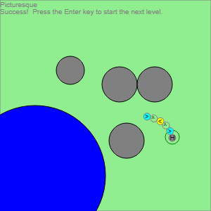

Logic Train Game
================

A logic train game implemented in JavaScript.

To play, open the file Source/LogicTrainGame.html in a web browser that runs JavaScript.

Use the arrow keys to change the order of cars in the train, then press the Enter key to start the train moving.

Starting at the front of the train, each car in the train will "execute" for a couple of seconds, then the next car will execute for a couple of seconds, and so on to the end of the train.  Some cars turn the train left or right, some move it forward, some do other things.  The goal is for the head of the train to be in the green goal circle when the last car is finished executing, without hitting any obstacles or the edge of the play area before that.

